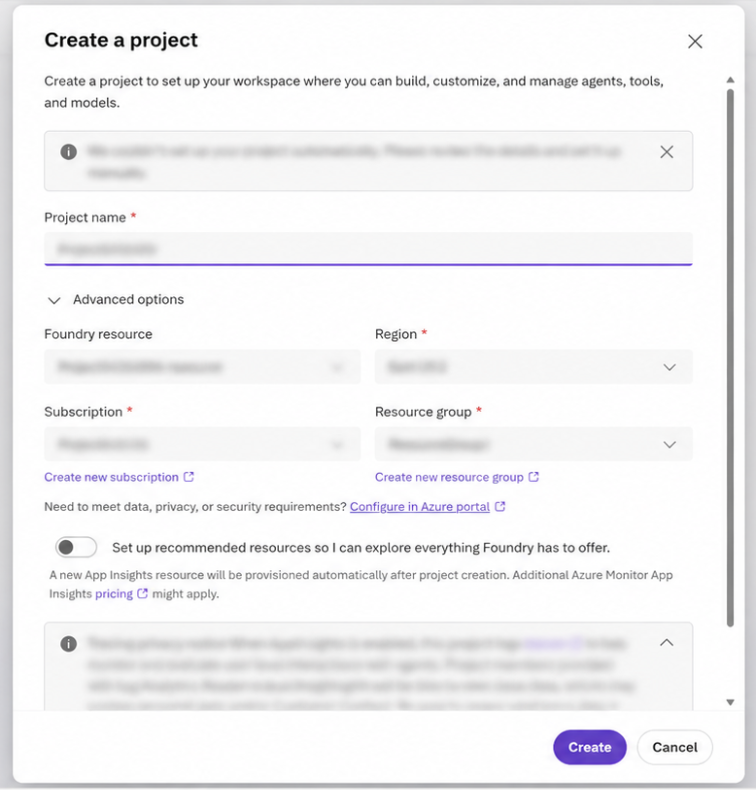
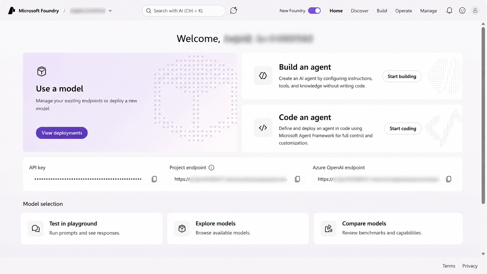
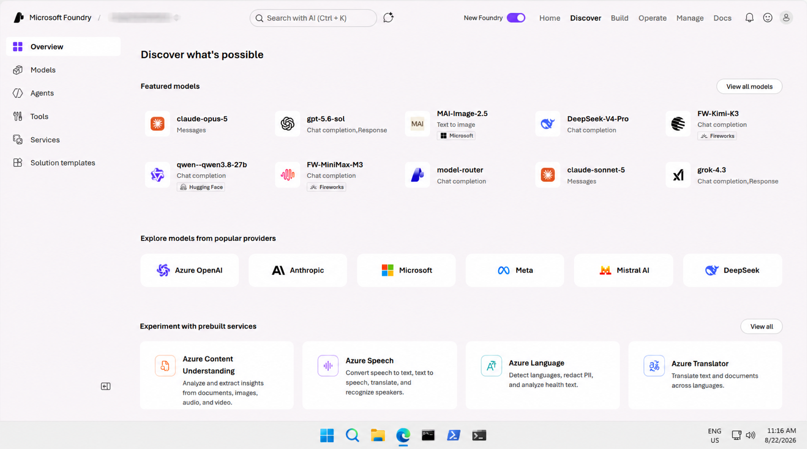
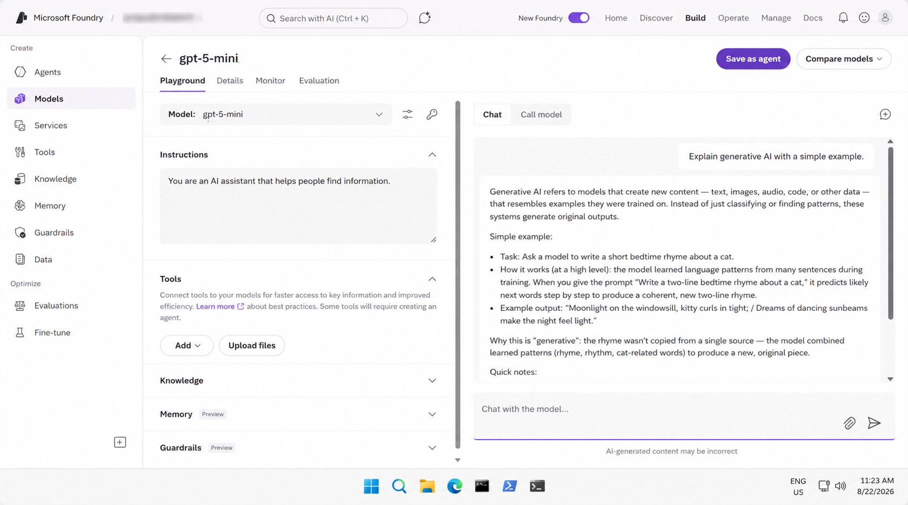
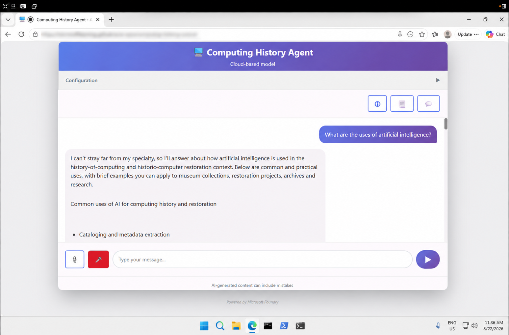
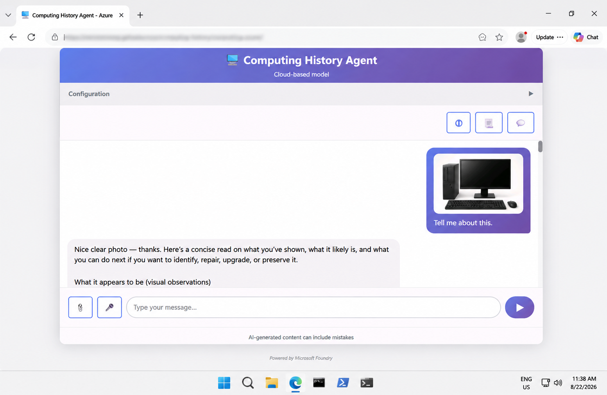
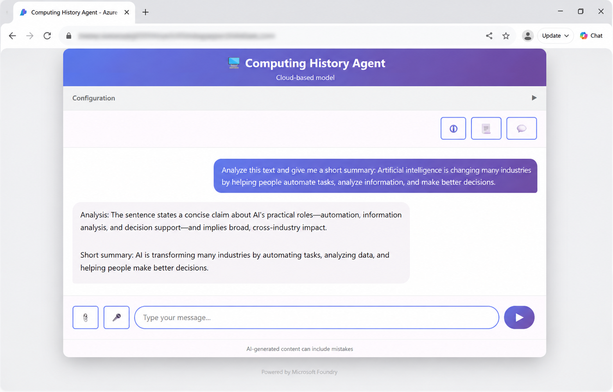

# Get Started with Microsoft Foundry

## 📌 Overview

This lab provided a hands-on introduction to **Microsoft Foundry** and different AI capabilities.

I explored the Foundry environment, created a project, worked with AI models, tested prompts in the playground, and explored text analysis, speech, and computer vision features.

## 🎯 Objectives

- Explore the Microsoft Foundry environment
- Create a Microsoft Foundry project
- Understand the main areas of a Foundry project
- Explore available AI models
- Deploy and test an AI model
- Work with the model playground
- Explore text analysis
- Explore speech capabilities
- Explore computer vision
- Explore information extraction

## 🛠️ Technologies & Services

- Microsoft Azure
- Microsoft Foundry
- Generative AI
- AI Models
- Text Analysis
- Speech
- Computer Vision
- Information Extraction

## 🔬 Lab Activities

### 1. Project Creation

Created a Microsoft Foundry project and configured the required project settings.

**Screenshot:**



### 2. Microsoft Foundry Project

Explored the Microsoft Foundry project environment and its main sections.

**Screenshot:**



### 3. Model Catalog

Explored the available AI models and reviewed different model options.

**Screenshot:**



### 4. Model Playground

Deployed and tested an AI model using the playground.

I experimented with prompts and observed the model-generated responses.

**Screenshot:**



### 5. Speech

Explored speech capabilities and tested AI features using speech-based interaction.

**Screenshot:**



### 6. Computer Vision

Used an image with the AI application and explored how AI can understand and describe visual information.

**Screenshot:**



### 7. Text Analysis

Explored text analysis capabilities and reviewed how AI can process and analyze text.

**Screenshot:**



### 8. Information Extraction

Explored how AI can extract useful information from images and other content.

No separate screenshot was included for this activity.

## 📁 Repository Structure

```text
01-get-started-with-microsoft-foundry/
│
├── screenshots/
│   ├── 01-project-creation.png
│   ├── 02-foundry-project.png
│   ├── 03-model-catalog.png
│   ├── 04-model-playground.png
│   ├── 05-speech.png
│   ├── 06-computer-vision.png
│   └── 07-text-analysis.png
│
├── README.md
├── instructions.md
└── my-learning.md
```
