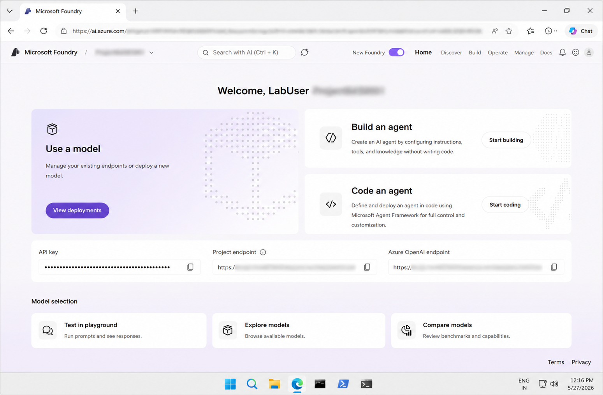
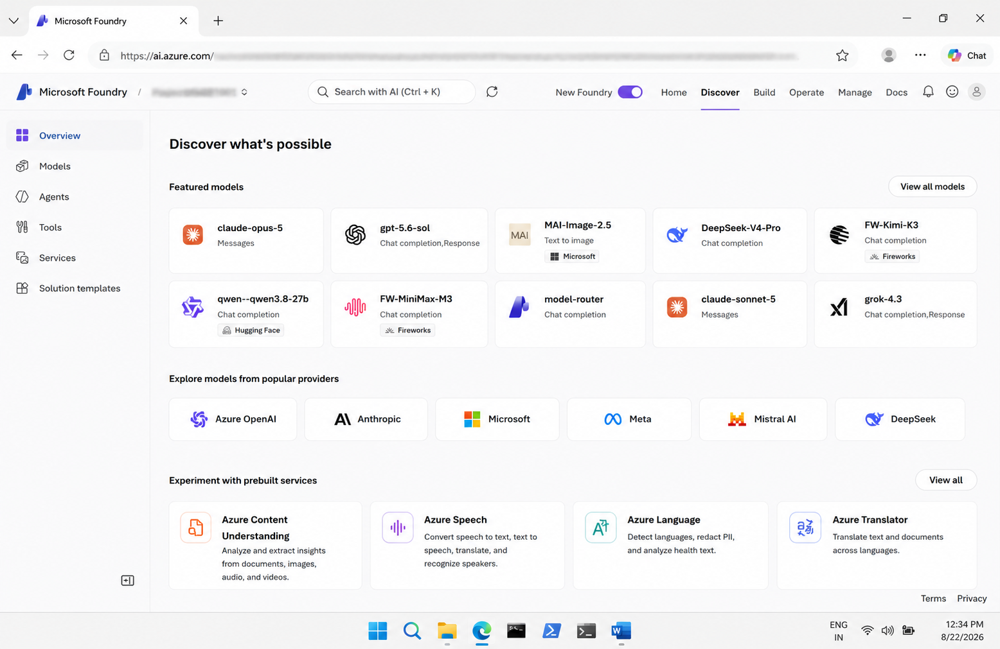
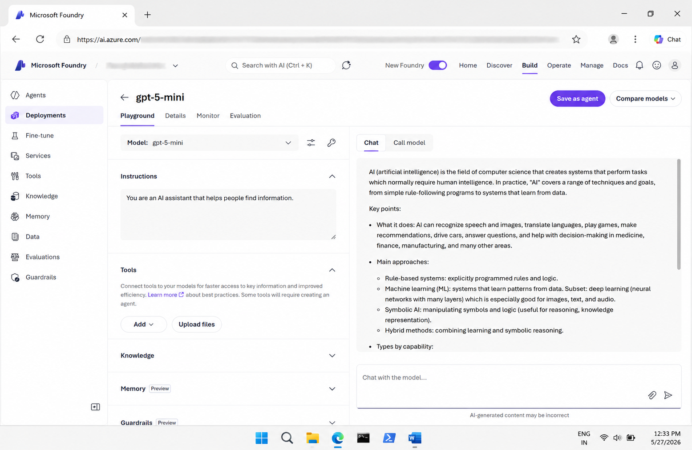
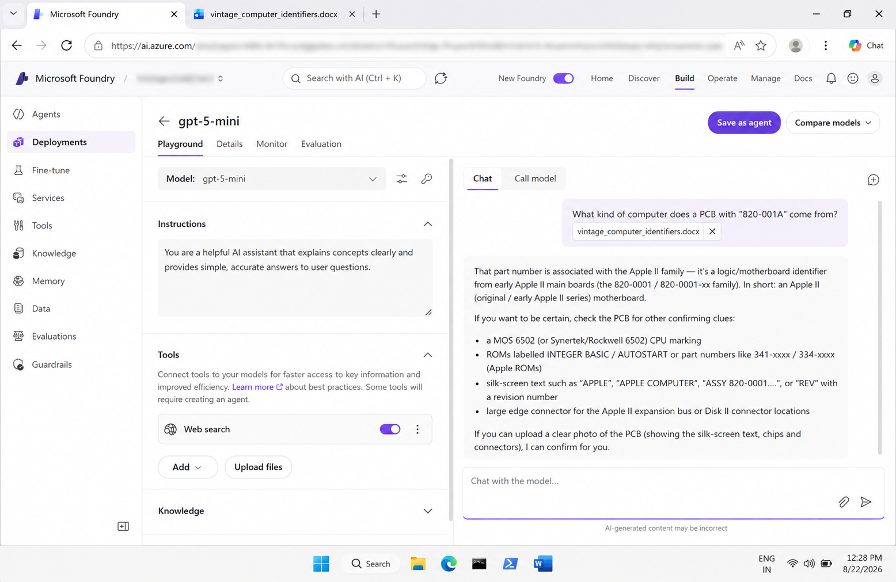
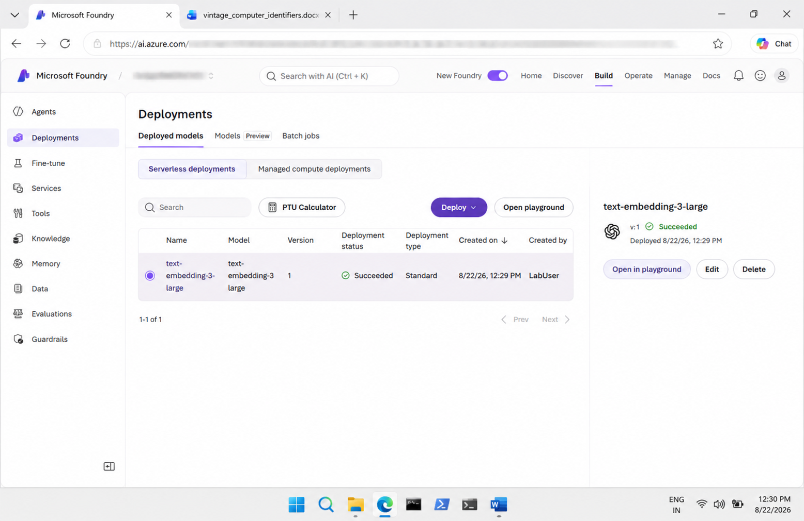

# Get Started with Generative AI and AI Agents in Microsoft Foundry

## 📌 Overview

This lab provided a hands-on introduction to **Generative AI and AI Agents using Microsoft Foundry**.

I deployed a generative AI model, tested it using the playground, explored web search capabilities, and created and tested an AI agent.

## 🎯 Objectives

- Explore Microsoft Foundry
- Deploy a generative AI model
- Chat with the deployed model
- Configure model instructions
- Add Web Search
- Create an AI agent
- Preview and test the agent
- Review the client code used to access the agent

## 🛠️ Technologies & Services

- Microsoft Azure
- Microsoft Foundry
- Generative AI
- GPT-5-mini
- Web Search
- AI Agents
- Python
- Azure AI Projects SDK

## 🔬 Lab Activities

### 1. Foundry Project

Explored the Microsoft Foundry project environment and its main features.

**Screenshot:**



### 2. Model Deployment

Explored the model catalog and deployed the **gpt-5-mini** model.

**Screenshot:**



### 3. Model Chat

Tested the deployed model in the playground using prompts and follow-up questions.

**Screenshot:**



### 4. Web Search

Enabled the Web Search tool and tested the model with queries requiring additional information.

**Screenshot:**



### 5. AI Agent

Created and tested an AI agent using the configured model and tools.

**Screenshot:**



## 💻 Python SDK

The `code/` folder contains a Python example for interacting with the AI agent programmatically.

### Example

- `agent_client.py` – Python client for accessing and interacting with the AI agent

The example demonstrates how an application can connect to the configured AI agent using the Azure AI Projects SDK.

## 📁 Repository Structure

```text
02-generative-ai-and-ai-agents/
│
├── code/
│   └── agent_client.py
│
├── screenshots/
│   ├── 01-foundry-project.png
│   ├── 02-model-deployment.png
│   ├── 03-model-chat.png
│   ├── 04-web-search.png
│   └── 05-agent.png
│
├── README.md
├── instructions.md
└── my-learning.md
```
