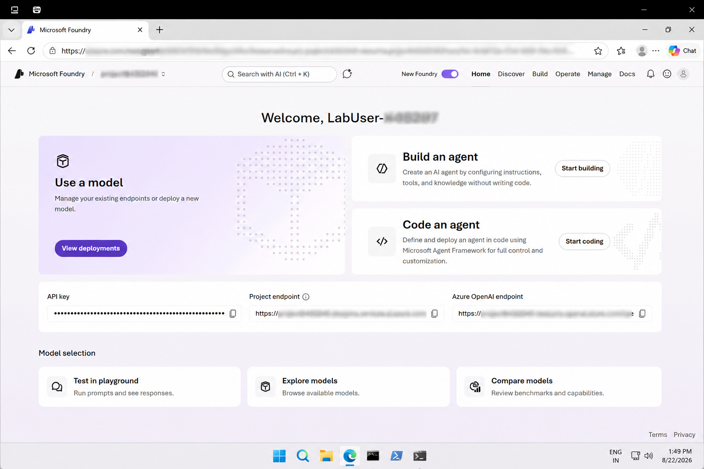
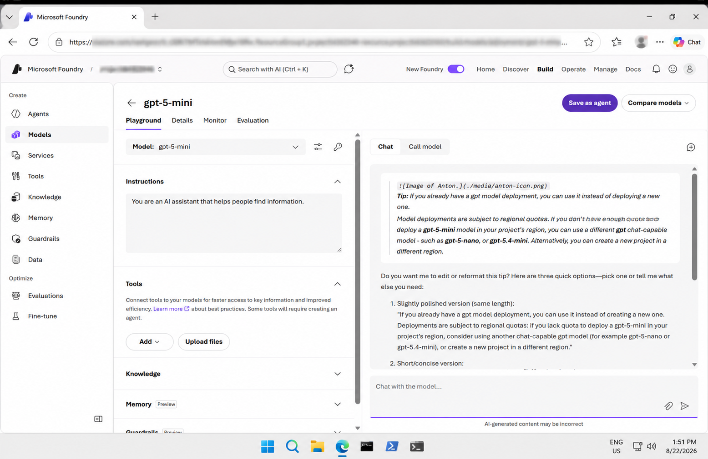
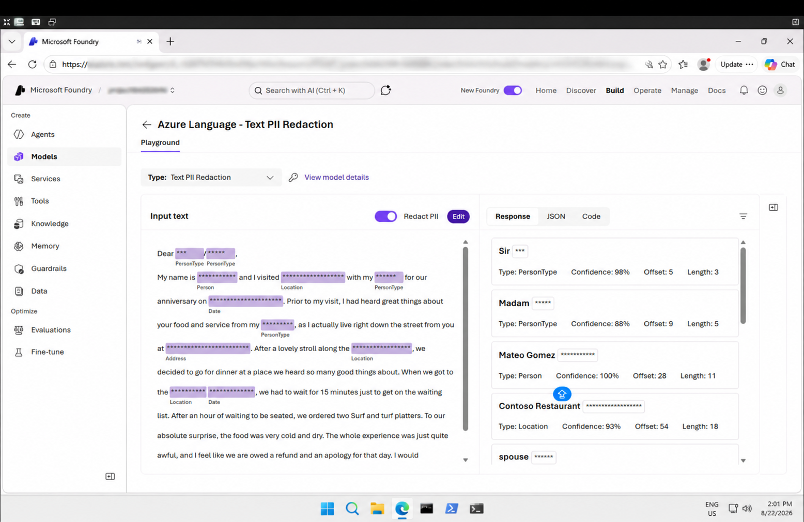

# Get Started with Text Analysis in Microsoft Foundry

## 📌 Overview

This lab provided a hands-on introduction to **Text Analysis using Microsoft Foundry**.

I explored text analysis using a generative AI model and Azure Language services. The lab included text summarization, language detection, and Personally Identifiable Information (PII) detection and redaction.

## 🎯 Objectives

- Explore text analysis using Microsoft Foundry
- Use a generative AI model to summarize text
- Explore Azure Language services
- Detect the language of text
- Identify Personally Identifiable Information (PII)
- Redact sensitive information from text
- Review Python examples for text analysis

## 🛠️ Technologies & Services

- Microsoft Azure
- Microsoft Foundry
- GPT-5-mini
- Azure Language
- Language Detection
- Text PII Redaction
- Python

## 🔬 Lab Activities

### 1. Microsoft Foundry Project

Opened the Microsoft Foundry project and explored the available AI capabilities for text analysis.

**Screenshot:**



### 2. Model Chat

Deployed **gpt-5-mini** and used the Chat Playground to interact with the model and analyze text.

**Screenshot:**



### 3. Text Summarization

Used the generative AI model to summarize a text document and generate a concise response.

**Screenshot:**


### 4. Language Detection

Used **Azure Language – Language Detection** to identify the language of the provided text and review the detection results.

**Screenshot:**


### 5. PII Detection and Redaction

Used **Azure Language – Text PII Redaction** to identify Personally Identifiable Information and generate a redacted version of the text.

**Screenshot:**



## 💻 Python Code

The `code/` folder contains Python examples related to text analysis.

### Examples

- `language_detection.py` – Example for detecting the language of text
- `pii_recognition.py` – Example for identifying PII in text

These examples demonstrate how Python can be used to work with Azure Language capabilities programmatically.

## 📁 Repository Structure

```text
03-text-analysis/
│
├── code/
│   ├── language_detection.py
│   └── pii_recognition.py
│
├── screenshots/
│   ├── 01-foundry-project.png
│   ├── 02-model-chat.png
│   ├── 03-text-summary.png .png
│   ├── 04-language-detection.png .png
│   └── 05-pii-redaction.png
│
├── README.md
├── instructions.md
└── my-learning.md
```
