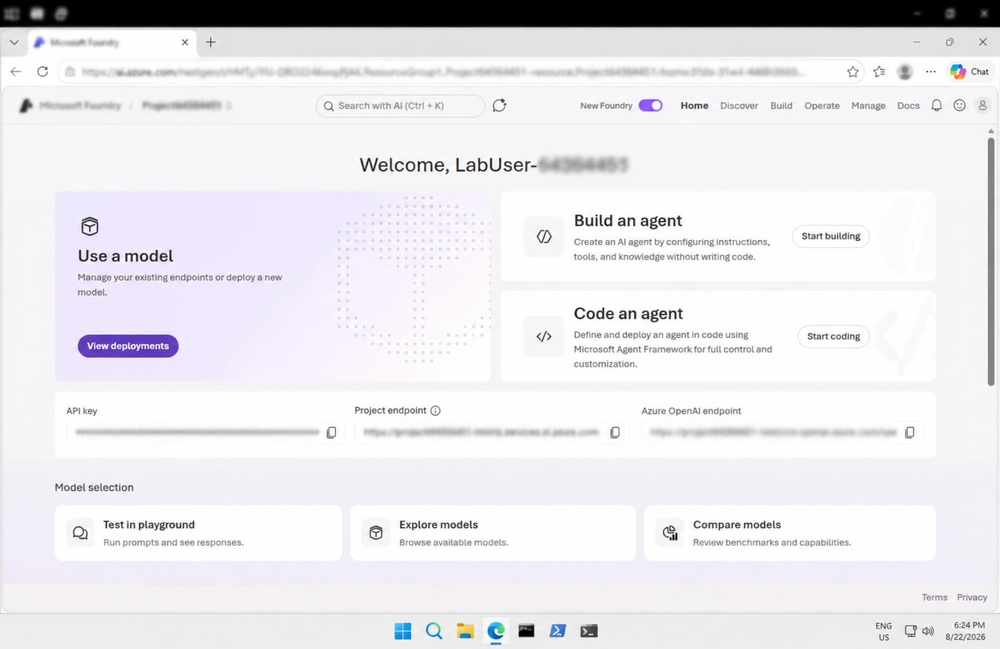
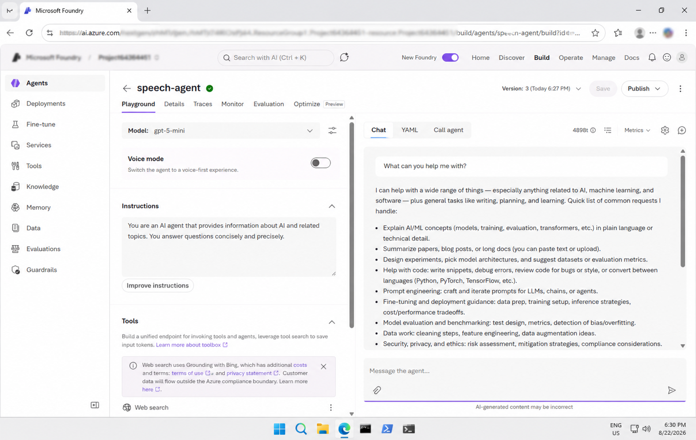
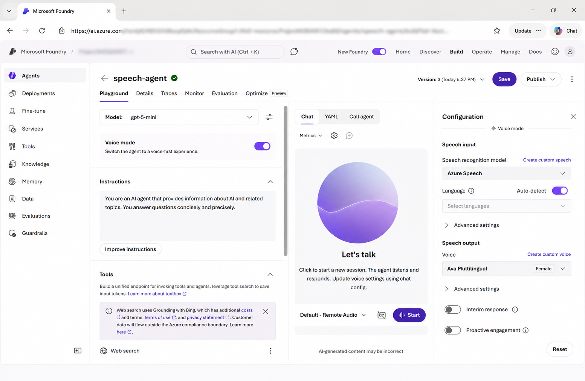
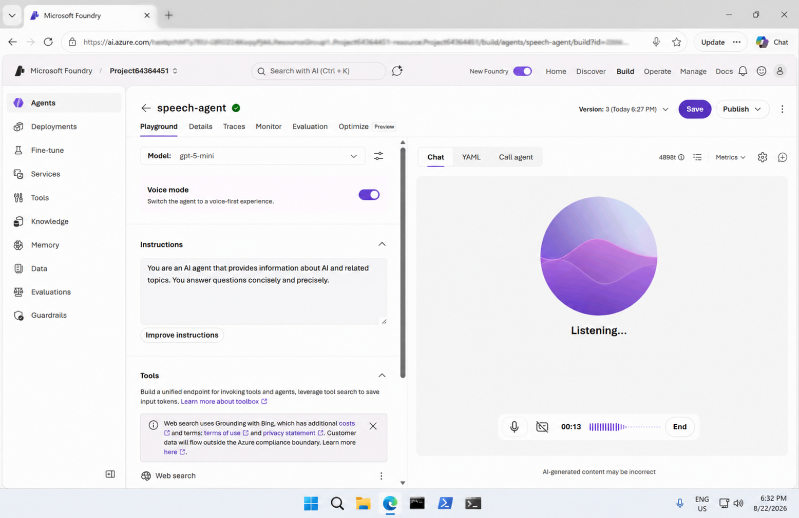
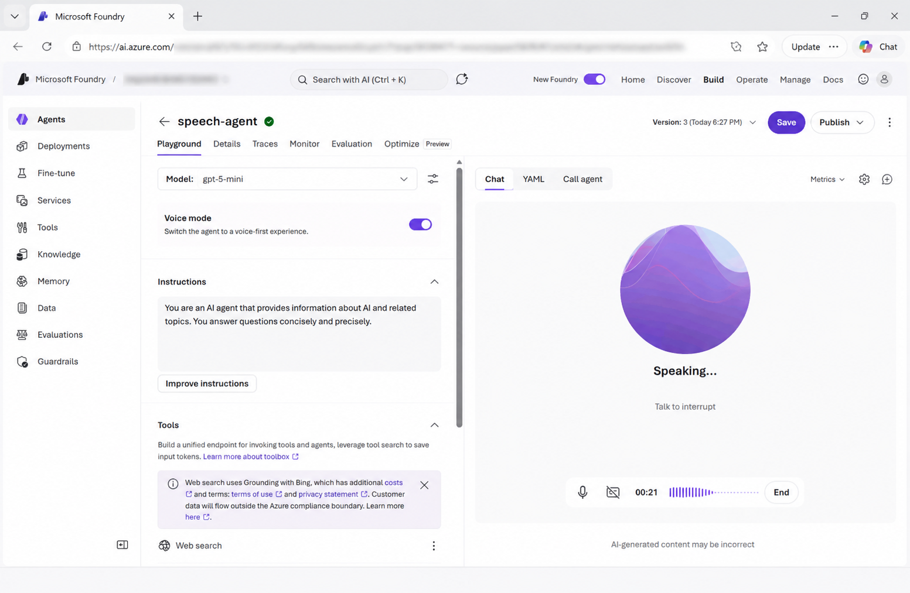
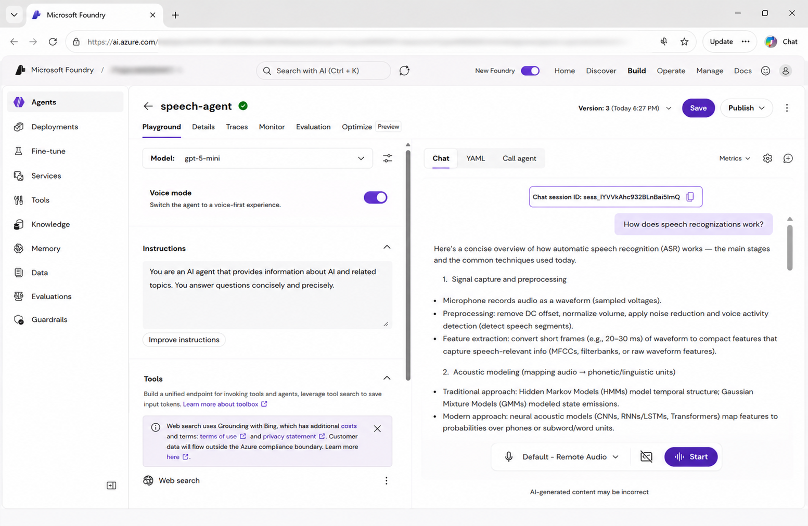

# Get Started with Speech in Microsoft Foundry

## 📌 Overview

This lab provided a hands-on introduction to **speech capabilities in Microsoft Foundry**.

I created a speech-capable AI agent, configured Voice mode using Azure Speech Voice Live, interacted with the agent using speech, and reviewed the client code used to access the agent.

## 🎯 Objectives

- Explore Microsoft Foundry
- Create an AI agent
- Configure agent instructions
- Enable Voice mode
- Configure speech input and output
- Interact with the agent using speech
- Explore speech recognition
- Explore speech synthesis
- Review the speech conversation transcript
- Review the client code for accessing the agent

## 🛠️ Technologies & Services

- Microsoft Azure
- Microsoft Foundry
- Generative AI
- GPT-5-mini
- Azure Speech
- Azure Speech Voice Live
- AI Agents
- Speech Recognition
- Speech Synthesis
- Python

## 🔬 Lab Activities

### 1. Microsoft Foundry Project

Created and explored a Microsoft Foundry project and its available AI capabilities.

**Screenshot:**



### 2. Create an AI Agent

Created an AI agent named **speech-agent** and configured it to provide concise information about AI and related topics.

**Screenshot:**



### 3. Configure Voice Mode

Enabled **Voice mode** and reviewed the speech input and output configuration, including the available voice settings.

**Screenshot:**



### 4. Speech Input Session

Started a speech session and interacted with the agent using spoken questions.

**Screenshot:**



### 5. Speech Output Session

Tested speech synthesis and reviewed the spoken response generated by the agent.

**Screenshot:**



### 6. Speech Transcript

Ended the speech session and reviewed the generated conversation transcript.

**Screenshot:**



### 7. Client Code

Opened the **Call agent** section and reviewed the sample client code for connecting to the Foundry project, accessing the agent, and handling audio input and output.

## 💻 Python Code

The `code/` folder contains the Python example used to interact with the speech-enabled AI agent.

### Example

- `agent_client.py` – Client code for connecting to the AI agent and handling the speech interaction.

Keep any API keys, endpoints, project identifiers, or other private information hidden before sharing the code publicly.

## 📁 Repository Structure

```text
04-speech/
│
├── code/
│   └── agent_client.py
│
├── screenshots/
│   ├── 01-foundry-project.png
│   ├── 02-speech-agent.png
│   ├── 03-voice-mode.png
│   ├── 04-speech-input-session.png
│   ├── 05-speech-output-session.png
│   └── 06-speech-transcript.png
│
├── instructions.md
└── README.md
```
