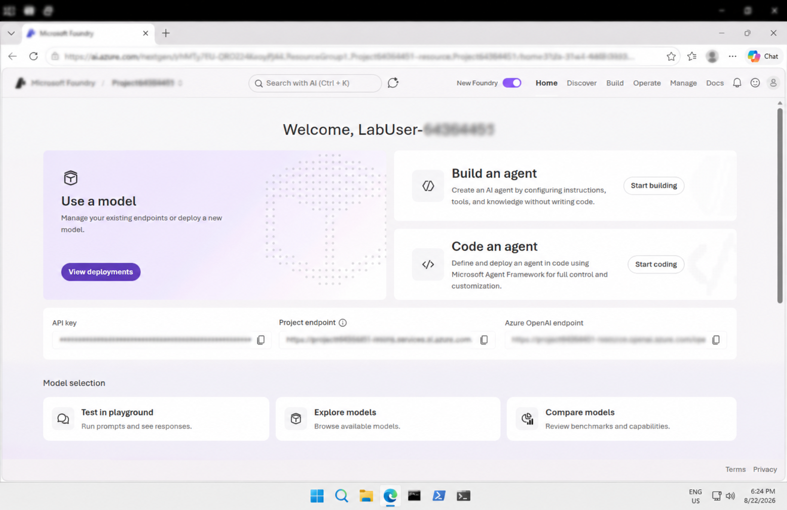
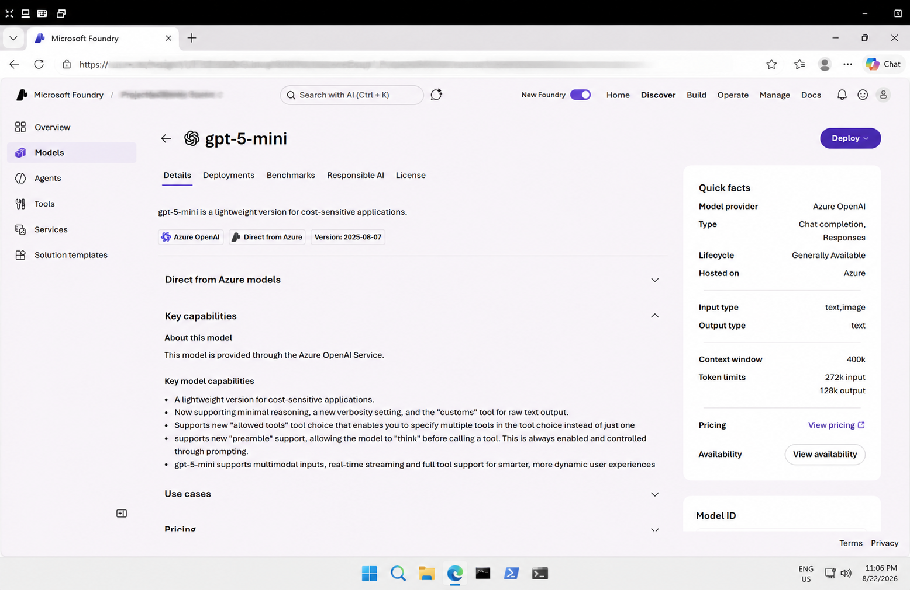
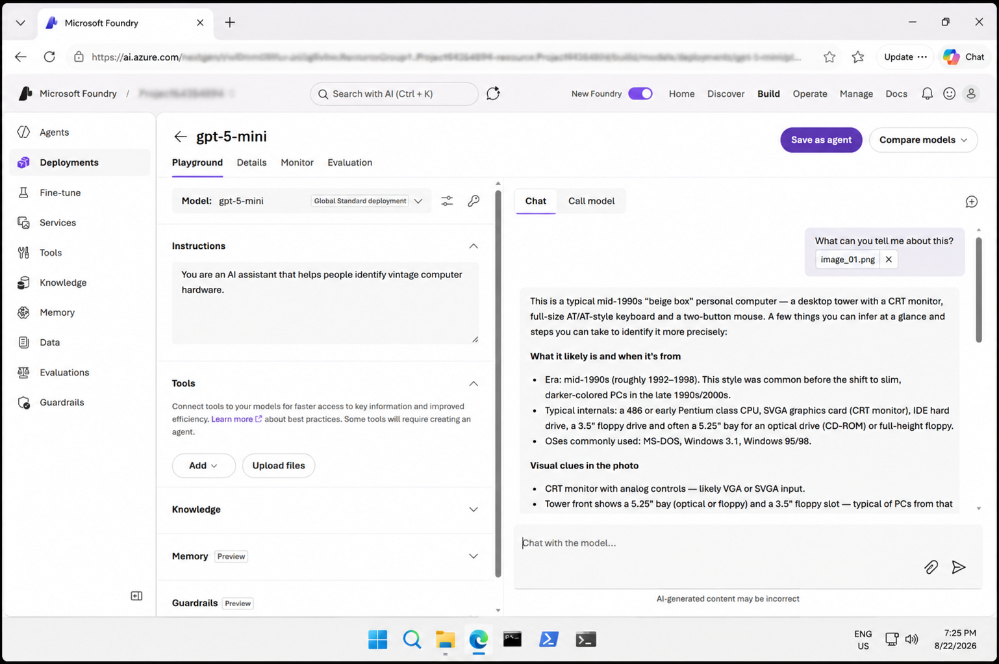
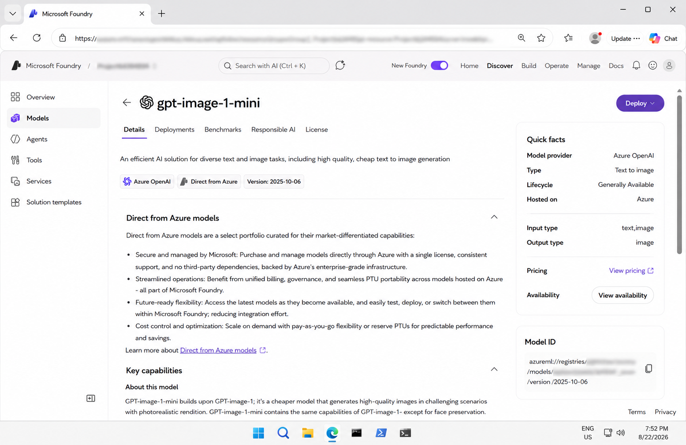
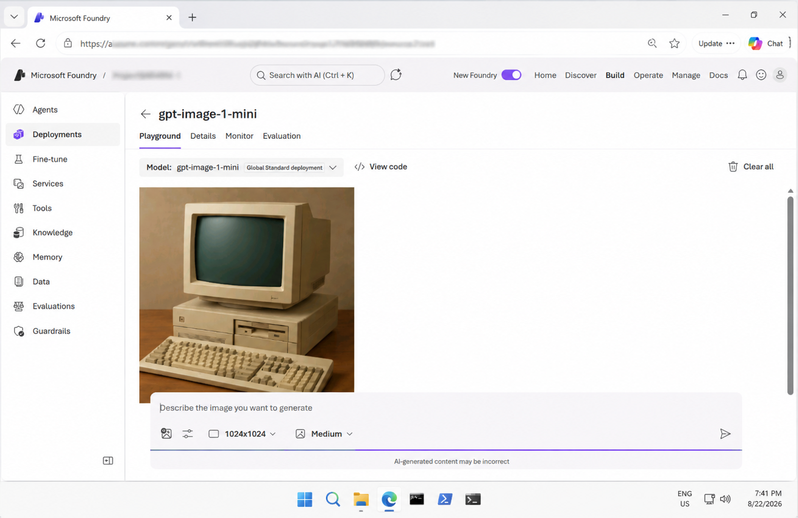
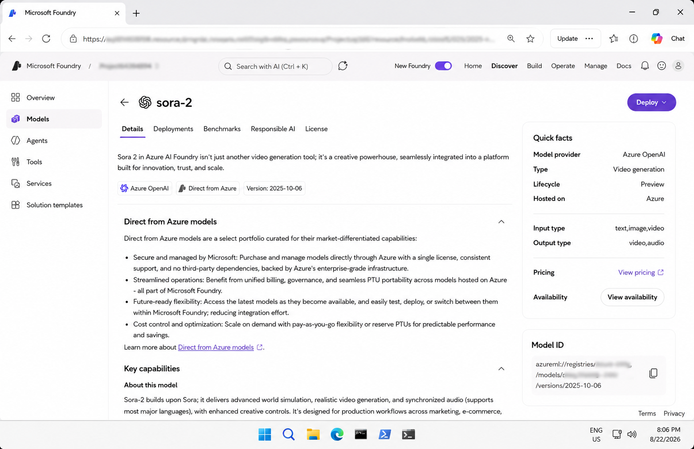
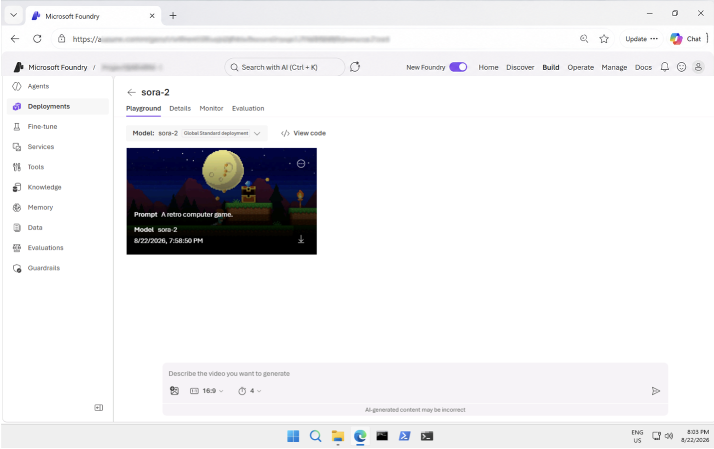

# Get Started with Computer Vision in Microsoft Foundry

## 📌 Overview

This lab provided a hands-on introduction to **computer vision and generative AI** in Microsoft Foundry.

I explored how AI can analyze images, generate images from text prompts, and generate videos using available models.

## 🎯 Objectives

- Explore Microsoft Foundry and computer vision capabilities
- Analyze images using a vision-capable model
- Generate images from text prompts
- Generate videos using Sora-2
- Review model-generated results
- Explore Python SDK and REST API code examples

## 🛠️ Technologies & Services

- Microsoft Azure
- Microsoft Foundry
- Azure OpenAI
- Computer Vision
- Image Analysis
- Image Generation
- Video Generation
- Python
- OpenAI SDK
- REST API

## 🔬 Lab Activities

### 1. Microsoft Foundry Project

Created and explored a Microsoft Foundry project for working with computer vision and generative AI models.

**Screenshot:**



### 2. Image Analysis Model

Deployed a vision-capable model and explored its capabilities in the Microsoft Foundry Playground.

**Screenshot:**



### 3. Image Analysis

Uploaded an image and used prompts to identify and describe its contents.

**Screenshot:**



### 4. Image Generation Model

Explored an available text-to-image model and its image-generation capabilities.

**Screenshot:**



### 5. Image Generation

Generated an image from a text prompt using the deployed image-generation model.

**Screenshot:**



### 6. Video Generation Model

Explored the available video-generation model **Sora-2** in Microsoft Foundry.

**Screenshot:**



### 7. Video Generation

Generated a short video using a text prompt and reviewed the result in the Playground.

**Screenshot:**



## 💻 Code

The `code/` folder contains examples for working with the explored capabilities programmatically.

### Examples

- `model_client.py` – Client code for interacting with the model and performing image analysis
- `image-generation.py` – Example for generating images using Python
- `video_generation.sh` – Example for generating videos using the REST API

Keep API keys, endpoints, project identifiers, and other private information hidden before sharing the code publicly.

## 📁 Repository Structure

```text
05-computer-vision/
│
├── code/
│   ├── image-generation.py
│   ├── model_client.py
│   └── video_generation.sh
│
├── image/
│   └── image_01.png
│
├── screenshots/
│   ├── 01-foundry-project.png
│   ├── 02-image-analysis-model.png
│   ├── 03-image-analysis.png
│   ├── 04-image-generation-model.png
│   ├── 05-image-generation.png
│   ├── 06-video-generation-model.png
│   └── 07-video-generation.png
│
├── instructions.md
└── README.md
```
