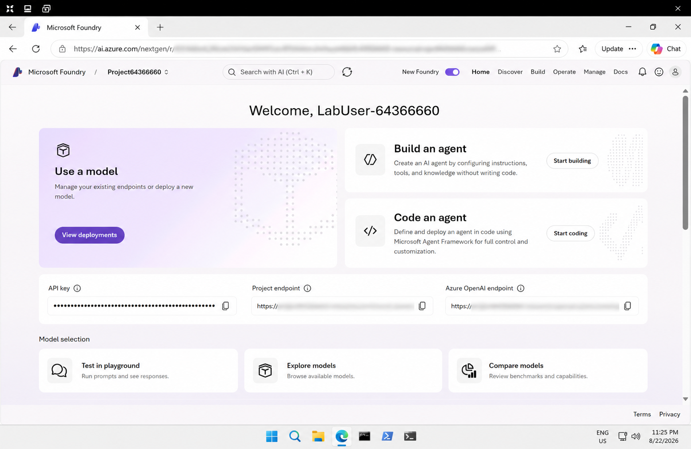
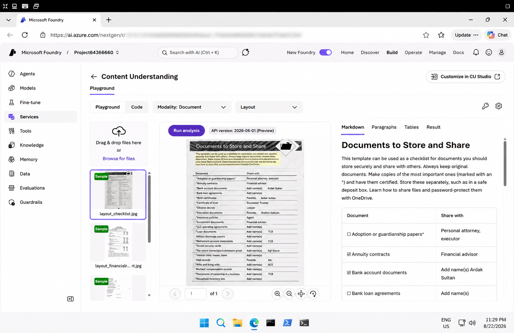
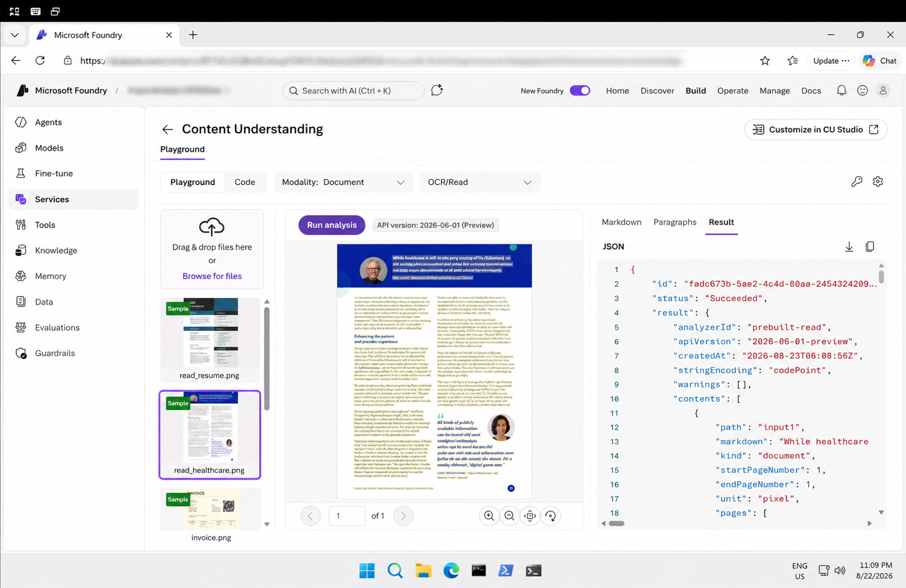
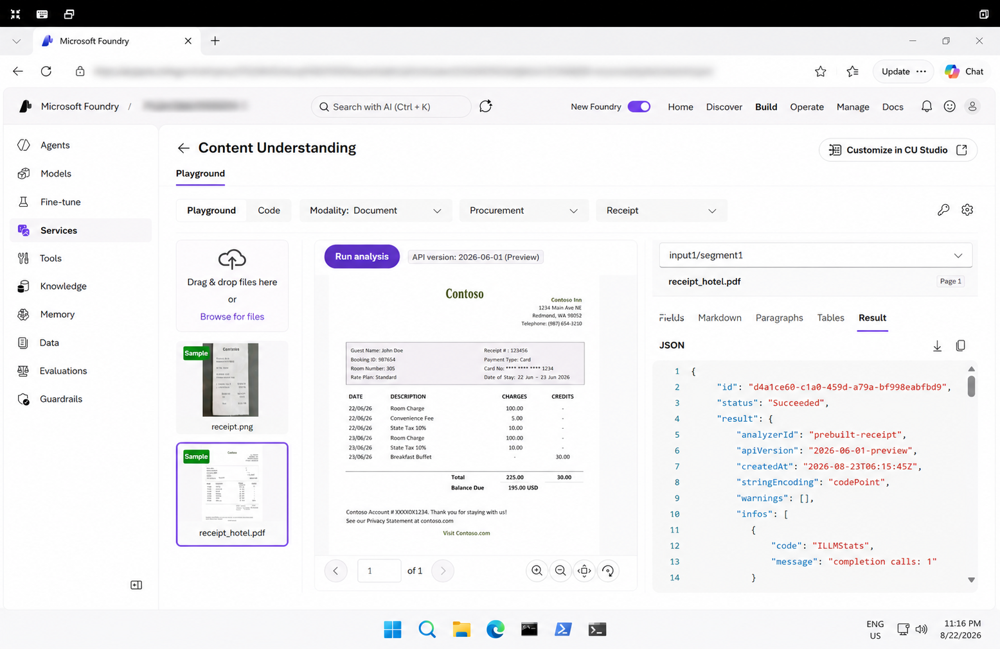
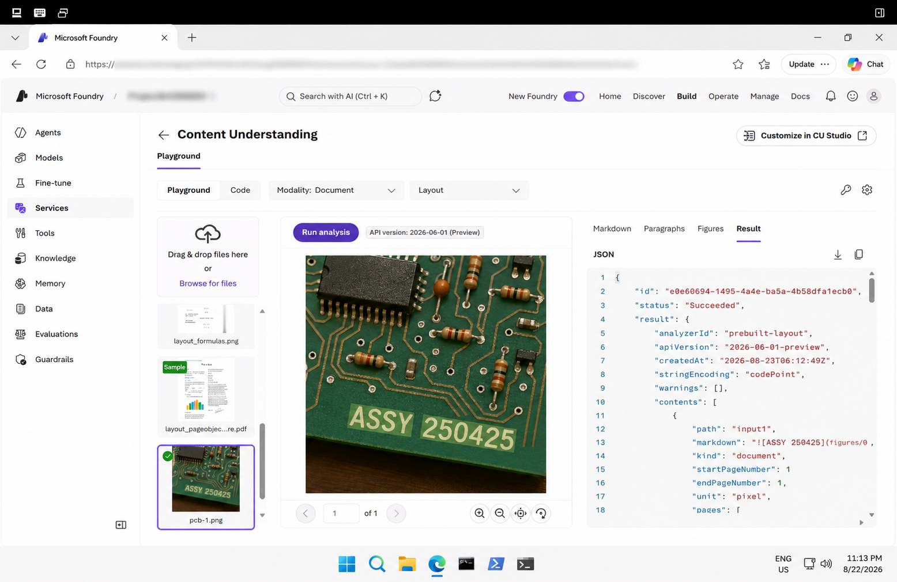

# Get Started with Information Extraction in Microsoft Foundry

## 📌 Overview

This lab provided a hands-on introduction to **Azure Content Understanding** in Microsoft Foundry.

I explored how AI can analyze documents and images, extract text, understand document layouts, and extract structured information from different types of content.

## 🎯 Objectives

- Explore Microsoft Foundry and Content Understanding
- Extract text from images using OCR
- Understand document layout
- Extract structured information from receipts
- Review analysis results in different formats
- Use the Azure Content Understanding Python SDK

## 🛠️ Technologies & Services

- Microsoft Azure
- Microsoft Foundry
- Azure Content Understanding
- OCR / Read
- Layout Analysis
- Receipt Analysis
- Python
- Azure Content Understanding Python SDK

## 🔬 Lab Activities

### 1. Microsoft Foundry Project

Created and explored a Microsoft Foundry project for working with Content Understanding.

**Screenshot:**



### 2. Content Understanding – Layout

Explored the Content Understanding playground and used the Layout analyzer to understand the structure of a document.

**Screenshot:**



### 3. OCR / Read

Used the OCR/Read analyzer to extract text from an image containing printed information.

**Screenshot:**



### 4. Receipt Analysis

Used the Receipt analyzer to extract useful information from a receipt and view the results as structured data.

**Screenshot:**



### 5. Layout Analysis

Analyzed an image using the Layout analyzer and reviewed the extracted document structure.

**Screenshot:**



## 💻 Python SDK

The `code/` folder contains Python examples for performing Content Understanding analysis programmatically.

### Examples

- `document_analysis.py` – OCR / document analysis
- `layout_analysis.py` – Layout analysis
- `receipt_analysis.py` – Receipt analysis

These examples demonstrate how the Azure Content Understanding Python SDK can be used to submit documents for analysis and process the returned results.

## 📁 Repository Structure

```text
06-information-extraction/
│
├── code/
│   ├── document_analysis.py
│   ├── layout_analysis.py
│   └── receipt_analysis.py
│
├── screenshots/
│   ├── 01-foundry-project.png
│   ├── 02-content-understanding-layout.png
│   ├── 03-ocr-read.png
│   ├── 04-receipt-analysis.png
│   └── 05-layout-analysis.png
│
├── instructions.md
└── README.md
```
